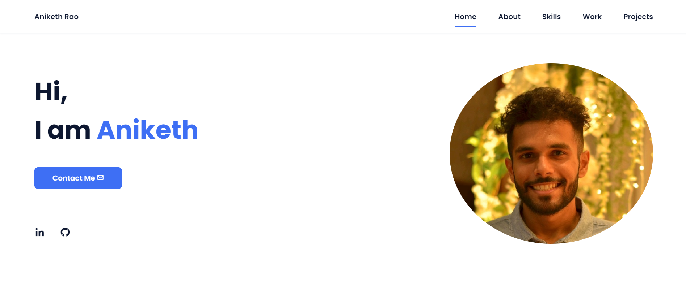

### Aniketh Rao - Portfolio

This repository contains the source code for Aniketh Rao's personal portfolio website. The website serves as a digital resume, showcasing Aniketh's skills, work experience, and projects.

### Section
- Home: A welcoming message and a contact button.
- About: An introduction to Aniketh Rao, his background, skills, and career aspirations.
- Skills: An overview of Aniketh's professional skills with proficiency indicators.
- Work Experience: Details of Aniketh's work experience as a Business Analyst at Zycus, Mumbai.
- Projects: Information about two notable projects, including descriptions and links to GitHub repositories.
- Footer: Links to Aniketh's LinkedIn and GitHub profiles and a reference to the source of inspiration for the website.

### External Resources
- Boxicons
- Font Awesome
- ScrollReveal

### Usage
To view the website, simply open the index.html file in a web browser.

